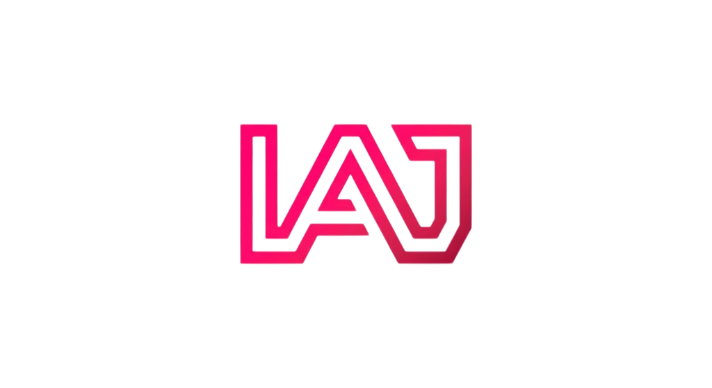

# ⚡ Isaac Alonso | Fullstack Software & Systems Architecture

<p align="center">
  
</p>

<p align="center">
  
  
  
  
</p>

---

## 💎 El Concepto: Starboy & Cyber-Dark
Este portfolio trasciende la función de currículum convencional para convertirse en un ejercicio de **ingeniería de frontend**. Bajo una estética inspirada en el movimiento *Cyber-Dark*, el proyecto se centra en la fluidez visual y la optimización de recursos.

### 🎨 Fundamentos del Diseño
* **Deep Contrast Layering:** Uso de `Pure Black` (#000000) y `Carbon Deep` (#232323) para generar una profundidad infinita y eliminar el cansancio visual.
* **Dual-State Highlights:** Implementación de un sistema cromático dual:
    * `Electric Fuchsia` (#FF0059) para proyectos estables y activos.
    * `Cyber Gold` (#FFD700) para proyectos en fase de investigación o **TFG**.
* **NFT-Style Tech Collection:** Galería interactiva con efecto `Coverflow` 3D que presenta el stack tecnológico como una colección de activos digitales premium.

---

## 🚀 Stack Tecnológico & Performance
Diseñado para la velocidad. La arquitectura evita frameworks de CSS pesados para mantener un *bundle size* mínimo y un rendimiento óptimo.

* **React 18:** Lógica basada en componentes funcionales y Hooks avanzados (`useRef`, `useMemo`) para gestión de animaciones.
* **Vite:** Motor de desarrollo de última generación para un Hot Module Replacement (HMR) instantáneo.
* **Canvas API Engine:** Motor de partículas personalizado programado en JavaScript puro. Ejecuta animaciones a **60fps** constantes mediante `requestAnimationFrame`.
* **Modern CSS Architecture:** Implementación de **Variables CSS (Tokens)**, Flexbox y Grid dinámico con efectos de `backdrop-filter: blur`.

---

## 🛠️ Características de Ingeniería

### 🌌 Constelación Reactiva (Hero Section)
Sistema de partículas dinámico en el Hero:
* Generación de **65 nodos** con vectores de movimiento independientes.
* Cálculo de **distancias euclidianas** en tiempo real para el trazado de conexiones entre partículas.
* Optimización de memoria mediante la limpieza de frames para evitar *memory leaks*.

### 🖼️ Project Gallery (Dynamic Cards)
Sistema de visualización de proyectos de alto impacto:
* **Target Management:** Control dinámico de apertura de enlaces (`_blank` vs `_self`) gestionado desde el `projectsData.js`.
* **Visual Continuity:** Línea divisoria de **2px** heredada del sistema de navegación (Nav) que actúa como separador de secciones.
* **Status Detection:** Lógica inteligente que detecta proyectos en **DESARROLLO** o **TFG**, aplicando automáticamente un tema dorado y efectos de resplandor (glow) específicos.

### 🧊 Tech Showcase (Swiper 3D)
La sección de tecnologías utiliza un efecto de **Glassmorphism** avanzado:
* **Hover Lumínico:** Las tarjetas se iluminan mediante gradientes internos y sombras de neón de **3px** para mantener la estabilidad del layout.
* **Reflejos Dinámicos:** Capa de cristal que reacciona al movimiento del ratón para simular profundidad física.

---

## 📁 Arquitectura del Proyecto
```bash
src/
 ├── components/       # UI Components (Navbar, Hero, Skills, ProjectCard)
 ├── assets/           # Media & Static Resources (Imágenes de proyectos)
 ├── data/             # JSON-based content (projectsData.js para fácil escalado)
 ├── App.jsx           # Main orchestrator & Layout logic
 └── index.css         # Design System: Tokens, Keyframes & Global Styles